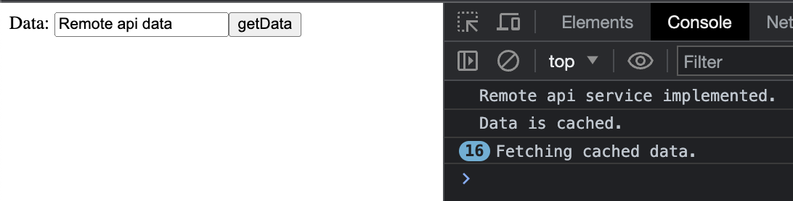

# angular-proxy-customApiCache
The subject of the application I developed with the Angular framework;
Caching the result returned from an executed api
and if that api process is run again, the request request is repeated
not thrown away and cached data is visible. I used Proxy pattern for this process..

*Sample testing;*

