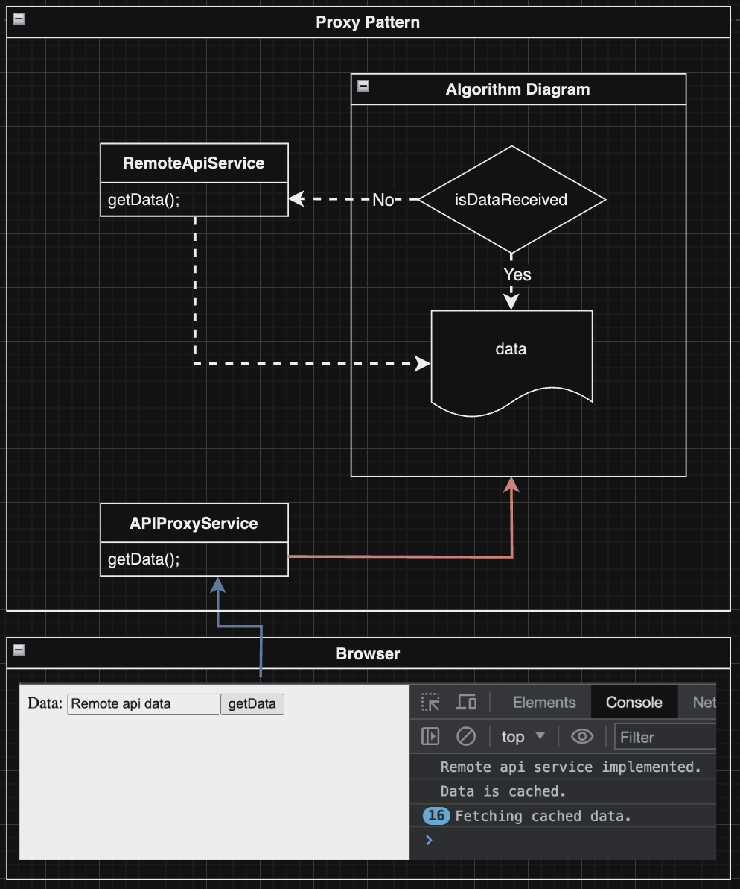

# angular-proxy-customApiCache
The main purpose of the application I developed using the Angular framework is to cache the results returned from an executed API call. If the same API process is performed again, the application utilizes the cached results from the previous request without making the request again. I employed the Proxy Pattern to manage and implement this process.

*Structure;*

